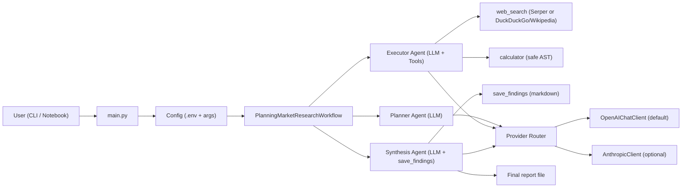
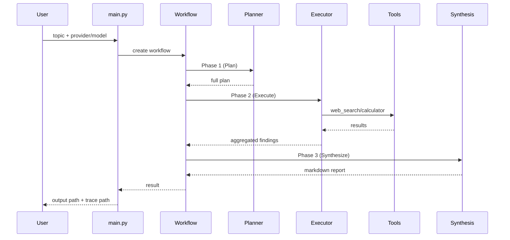
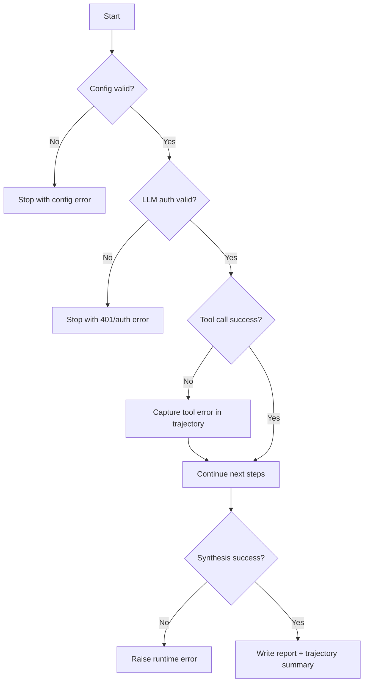

# Planning Pattern Market Research (OpenAI default)

This project is a Planning-pattern agent workflow (Plan -> Execute -> Synthesize) built with Microsoft Agent Framework.

This folder was cloned from the original implementation at:
- https://github.com/gsantopaolo/gsantopaolo.github.io/tree/main/examples/planning-claude-sdk-market-research

Then adapted to:
- Add OpenAI client support
- Use OpenAI as default provider/model
- Keep Anthropic as optional provider
- Add interactive notebook for DS/AI researchers

## What's inside

- `main.py`: CLI entrypoint
- `planning_workflow.py`: planner/executor/synthesis workflow
- `tools.py`: `web_search`, `calculator`, `save_findings`
- `.env.example`: provider/key configuration
- `planning_pattern_interactive_lab.ipynb`: notebook-first workflow
- `docs/AGENT_ARCHITECTURE.md`: professional architecture and flow diagrams

## Architecture

- Read: `docs/AGENT_ARCHITECTURE.md`
- Tracing for training data: `docs/TRAJECTORY_TRACING.md`
- Agent Framework tutorial series: `docs/agent-framework-series/README.md`

### System Architecture



### Runtime Flow



### Failure Path



## Provider model defaults

- Default provider: `openai`
- Default OpenAI model: `gpt-4.1-mini`
- Optional provider: `anthropic` (`claude-opus-4-6` default)

## Requirements

- Python 3.10+
- `agent-framework` (pre-release)
- Optional Serper API key (`SERPER_API_KEY`) for premium web search
- No-key fallback search via DuckDuckGo + Wikipedia
- LLM API key:
  - OpenAI: `OPENAI_API_KEY` (default path)
  - Anthropic: `ANTHROPIC_API_KEY` (if `LLM_PROVIDER=anthropic`)

## Setup

```bash
cd plan-execute-synthesize-agent
pip install -r requirements.txt
cp .env.example .env
```

Edit `.env`.

Minimal OpenAI config:

```dotenv
LLM_PROVIDER=openai
OPENAI_API_KEY=sk-proj-...
OPENAI_MODEL=gpt-4.1-mini
SERPER_API_KEY=your-serper-api-key
TRACE_TRAJECTORY=true
TRACE_DIR=trajectories
```

No-key search mode (DuckDuckGo + Wikipedia fallback):

```dotenv
LLM_PROVIDER=openai
OPENAI_API_KEY=sk-proj-...
OPENAI_MODEL=gpt-4.1-mini
SERPER_API_KEY=
TRACE_TRAJECTORY=true
TRACE_DIR=trajectories
```

Optional Anthropic config:

```dotenv
LLM_PROVIDER=anthropic
ANTHROPIC_API_KEY=sk-ant-...
ANTHROPIC_MODEL=claude-opus-4-6
SERPER_API_KEY=your-serper-api-key
```

## Run (CLI)

```bash
python main.py "AI agent market size 2024-2026"
```

Disable tracing for a specific run:

```bash
python main.py "AI agent market size 2024-2026" --no-trace
```

Override provider/model at runtime:

```bash
python main.py "AI agent market size 2024-2026" --provider openai --model gpt-4.1-mini
python main.py "AI agent market size 2024-2026" --provider anthropic --model claude-opus-4-6
```

Write traces to a custom directory:

```bash
python main.py "AI agent market size 2024-2026" --trace-dir /tmp/agent-traces
```

## Run (Notebook)

Open and run:
- `planning_pattern_interactive_lab.ipynb`

Notebook flow:
1. Env + dependency checks
2. Key/provider diagnostics
3. Direct tool testing
4. Workflow construction
5. End-to-end inference

## Outputs

- Final report: `planning_market_report.md` (or path from `--output`)
- Tool markdown output (optional): `outputs/*.md`
- Trajectory events: `trajectories/<run_id>.jsonl`
- Trajectory summary: `trajectories/<run_id>.summary.json`

## Search Quality Notes

- Best quality: configure `SERPER_API_KEY` (more stable market/industry links).
- No-key mode (`DuckDuckGo + Wikipedia`) is convenient for development and demos, but source quality and coverage can vary by query.
- For decision-grade reports, prefer:
  1. Serper enabled
  2. Cross-verification across at least 2 independent sources
  3. Manual review of critical market figures before sharing externally

## Security notes

- Never commit `.env`.
- Rotate keys immediately if they were shared in plaintext.
- Keep API keys in environment variables or secret manager.

## Notes

`agent-framework` is currently pre-release; APIs may change. This project already includes compatibility updates for current package behavior.
