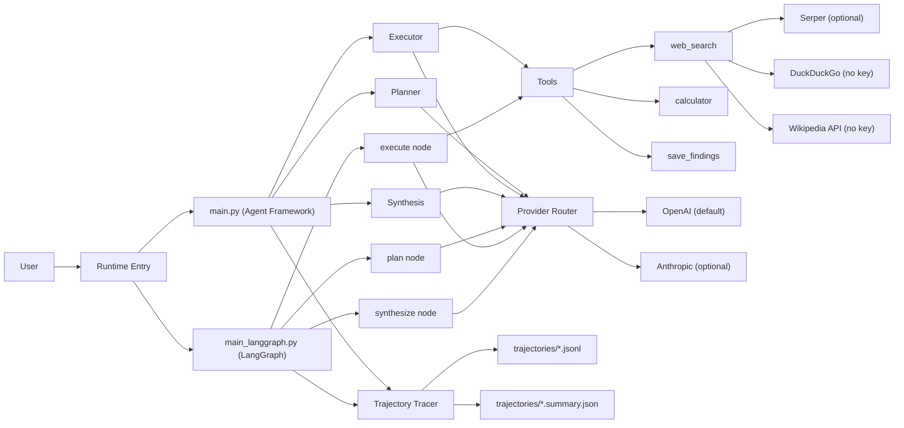

# Plan-and-Execute Agent Framework

Production-oriented implementation of the **Planning pattern** for agentic systems:

**Plan -> Execute -> Synthesize**

This repository started from a cloned example and has been significantly extended into a reusable framework for research automation, experimentation, and trajectory data collection.

## Origin and evolution

Original source (cloned):
- https://github.com/gsantopaolo/gsantopaolo.github.io/tree/main/examples/planning-claude-sdk-market-research

This codebase now diverges substantially from the original.

## What changed (major)

- OpenAI client integration with **OpenAI as default provider**
- Anthropic kept as optional provider
- Added **LangGraph implementation** in parallel with Microsoft Agent Framework flow
- Added **trajectory tracing** (JSONL + run summary) for offline analysis and training datasets
- Added fallback web search stack with **no search API key required** (DuckDuckGo + Wikipedia)
- Added notebook-first UX for Data Scientist / AI Researcher workflows
- Added architecture docs and a full documentation series for the framework

## Current architecture



## Repository layout

- `main.py`: Microsoft Agent Framework runtime
- `main_langgraph.py`: LangGraph runtime
- `planning_workflow.py`: Plan-Execute-Synthesize workflow (Agent Framework)
- `langgraph_workflow.py`: Plan-Execute-Synthesize workflow (LangGraph)
- `tools.py`: `web_search`, `calculator`, `save_findings`
- `trajectory_tracing.py`: tracing contract and JSONL writer
- `planning_pattern_interactive_lab.ipynb`: interactive notebook for DS/AI researchers
- `docs/AGENT_ARCHITECTURE.md`: architecture and flow diagrams
- `docs/LANGGRAPH_IMPLEMENTATION.md`: LangGraph-specific design
- `docs/TRAJECTORY_TRACING.md`: trajectory data design and training mindset
- `docs/agent-framework-series/README.md`: full docs series

## Quickstart (conda: vllm)

```bash
cd plan-execute-synthesize-agent
conda activate vllm
pip install -r requirements.txt
cp .env.example .env
```

Minimal `.env` (OpenAI default):

```dotenv
LLM_PROVIDER=openai
OPENAI_API_KEY=sk-proj-...
OPENAI_MODEL=gpt-4.1-mini
SERPER_API_KEY=
TRACE_TRAJECTORY=true
TRACE_DIR=trajectories
```

Optional Anthropic mode:

```dotenv
LLM_PROVIDER=anthropic
ANTHROPIC_API_KEY=sk-ant-...
ANTHROPIC_MODEL=claude-opus-4-6
SERPER_API_KEY=
TRACE_TRAJECTORY=true
TRACE_DIR=trajectories
```

## Run

Agent Framework runtime:

```bash
python main.py "AI agent market size 2024-2026"
```

LangGraph runtime:

```bash
python main_langgraph.py "AI agent market size 2024-2026" --provider openai --model gpt-4.1-mini
```

Disable tracing:

```bash
python main.py "AI agent market size 2024-2026" --no-trace
```

Custom trace directory:

```bash
python main.py "AI agent market size 2024-2026" --trace-dir /tmp/agent-traces
```

## Notebook workflow

Open and run:
- `planning_pattern_interactive_lab.ipynb`

Notebook includes:
- env and dependency checks
- provider/key diagnostics
- direct tool testing
- workflow construction
- end-to-end inference run

## Tracing for training data

Each run produces:
- `trajectories/<run_id>.jsonl`
- `trajectories/<run_id>.summary.json`

Typical events:
- `run_started`
- `phase`
- `tool_call`
- `tool_result`
- `message_snapshot`
- `run_completed`
- `final_report`

This structure is designed for:
- trajectory analysis
- supervised finetuning dataset curation
- reward/preference data preparation

## Search stack and quality

`web_search` provider order:
1. Serper (if `SERPER_API_KEY` is set)
2. DuckDuckGo
3. Wikipedia API

Quality guidance:
- Enable Serper for more stable market/industry sources
- In no-key mode, always cross-check critical numbers from multiple independent links

## Project status

- LangGraph implementation: working
- OpenAI default provider: working
- Anthropic optional provider: supported
- Tracing pipeline: working
- Notebook path: available for interactive exploration

## Security

- Never commit `.env`
- Never commit API keys
- Rotate any key immediately if it was exposed

## Acknowledgement

Thanks to the original author for the initial Planning pattern example. This repository keeps attribution and extends the project into a broader agent-framework implementation.
