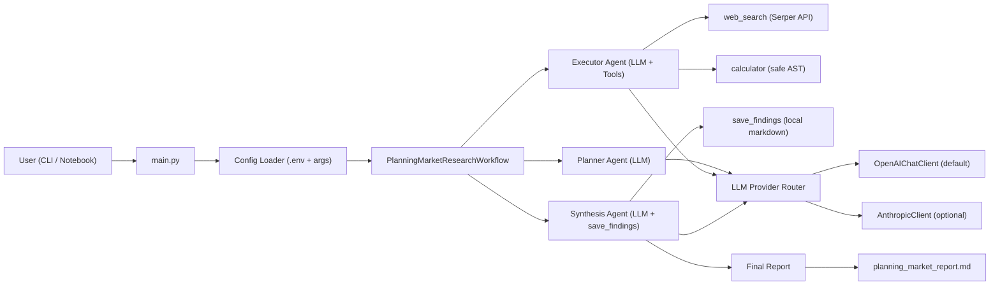
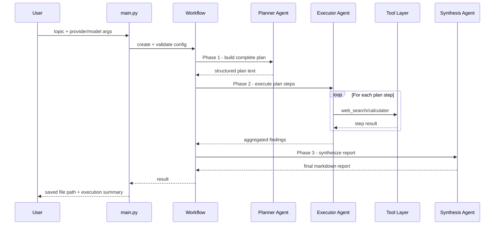
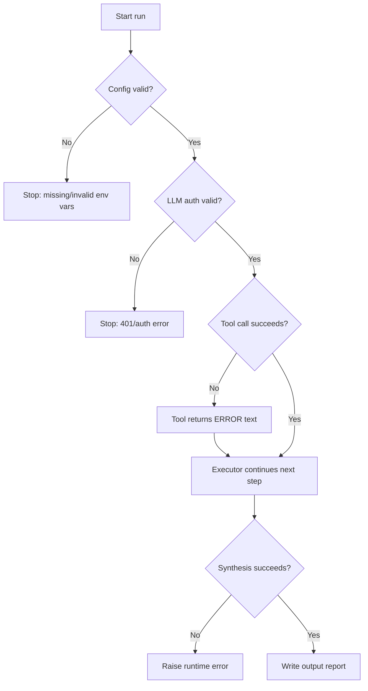

# Agent Architecture

This document explains the architecture and runtime flow of the Planning-pattern agent in a concise, production-style format.

## 1. System Architecture

## 2. Runtime Sequence

## 3. Failure and Recovery Path

## 4. Design Notes

- Pattern: `Plan -> Execute -> Synthesize`
- Provider abstraction:
  - default: OpenAI (`OPENAI_API_KEY`, `OPENAI_MODEL`)
  - optional: Anthropic (`ANTHROPIC_API_KEY`, `ANTHROPIC_MODEL`)
- Tool safety:
  - calculator uses AST parsing, not `eval()`
  - file output path is sanitized in `save_findings`
- Operational behavior:
  - workflow is resilient to single-step tool failures (captures errors and continues)
  - final report quality depends on both web search quality and model quality
