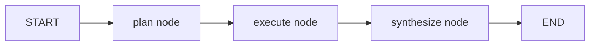

# LangGraph Implementation

This document describes the LangGraph version of the project and its tracing behavior.

## Files

- `main_langgraph.py`: CLI entrypoint for the LangGraph workflow
- `langgraph_workflow.py`: Graph definition (`plan -> execute -> synthesize`)
- `trajectory_tracing.py`: shared JSONL tracer (same schema as Agent Framework flow)
- `tools.py`: shared tool layer (`web_search`, `calculator`, `save_findings`)

## Graph topology



## Node responsibilities

- `plan`:
  - calls model to produce JSON plan (`steps`)
  - validates/parses JSON
  - falls back to predefined steps if parsing fails
- `execute`:
  - runs each planned step with shared tools
  - captures per-step success/error
- `synthesize`:
  - composes final markdown report from findings
  - saves an additional output via `save_findings`

## Tracing parity

LangGraph version uses exactly the same tracer contract as the original flow:

- `run_started`
- `phase`
- `tool_call`
- `tool_result`
- `message_snapshot`
- `run_completed`
- `final_report`

All traces are written to:

- `trajectories/<run_id>.jsonl`
- `trajectories/<run_id>.summary.json`

## Run command

```bash
python main_langgraph.py "AI agent market size 2024-2026" --provider openai --model gpt-4.1-mini
```

Optional:

```bash
python main_langgraph.py "AI agent market size 2024-2026" --no-trace
python main_langgraph.py "AI agent market size 2024-2026" --trace-dir /tmp/agent-traces
```
